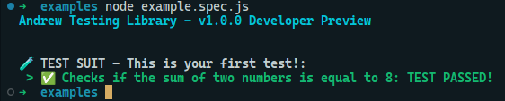

## SETTING ANDREW TESTING LIBRARY UP

> Download the latest version Andrew Testing Library [here](), extract it somewhere inside the folder of your project and then create a folder named **test** and a file named **example.spec.ts**, then proceed to the next section.

### WRITING YOUR FIRST TEST

Paste the following code into the example.spec.ts file then save it.

```ts
import { AndrewTesting } from "../core/assert";

AndrewTesting.describe("This is your first test!", () => {
  AndrewTesting.test("Checks if the sum of two numbers is equal to 8", () => {
    const num1 = 4
    const num2 = 4;
    const sum = 8;

    AndrewTesting.shouldBeEqual(sum, 8);
  });
});
```

The test above checks whether the sum of two numbers is equal to 8. Now open your terminal at the folder where you saved your test and type `node example.spec.js` (note that you should compile your TypeScript file to JavaScript first). You should get the following output in the terminal:



`describe(title, () => {})` creates a test suit, a group of tests, whereas `test(title, () => {})` refers to each one of the tests.

## MATCHERS

- **shouldBeEqual**
- **shouldNotBeEqual**
- **shouldBeStrictEqual**
- **shouldNotBeStrictEqual**
- **shouldBeNull**
- **shouldNotBeNull**
- **shouldBeUndefined**
- **shouldNotBeUndefined**
- **shouldBeTruthy**
- **shouldBeFalsy**

### MATCHERS FOR NUMBERS

- **shouldBeGreaterThan**
- **shouldNotBeGreaterThan**
- **shouldBeGreaterThanOrEqual**
- **shouldNotBeGreaterThanOrEqual**
- **shouldBeLessThan**
- **shouldNotBeLessThan**
- **shouldNotBeLessThanOrEqual**

### MATCHERS FOR COMPARING ARRAYS AND OBJECTS

- **shouldBeEqualArr** (for *arrays*)
- **shouldNotBeEqualArr** (for *arrays*)
- **shouldBeEqualObj** (for *objects*)
- **shouldNotBeEqualObj** (for *objects*)